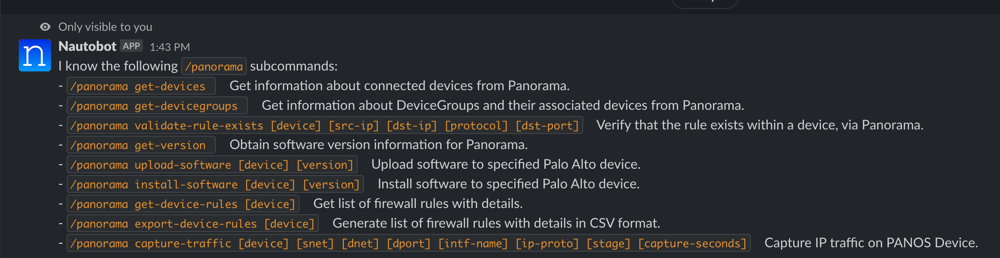

# Nautobot Panorama ChatOps

This is a plugin for [Nautobot](https://github.com/nautobot/nautobot) that extends ChatOps support to Palo Alto Panorama systems. The plugin adds some useful commands into your ChatOps environment that enhances an administrator's and end user's day-to-day usage of Panorama. This framework allows for the quick extension of new ChatOps commands for Panorama.

Note: While this plugin requires Nautobot and the base Nautobot ChatOps plugin, it does _not_ require the Panorama or Palo Alto inventory to be in Nautobot. It is effectively Nautobot-independent, except for using it as a backend to run the chatbot itself.

## Usage

The supported commands are listed below. We welcome any new command or feature requests by submitting an issue or PR.

| /panorama Command    | Description                                                                |
| -------------------- | -------------------------------------------------------------------------- |
| get-devices          | Get information about connected devices from Panorama.                     |
| get-devicegroups     | Get information about DeviceGroups and their devices from Panorama.        |
| validate-rule-exists | Verify that a specific ACL rule exists within a device, via Panorama.      |
| get-version          | Obtain software version information for Panorama.                          |
| upload-software      | Upload software to specified Palo Alto device.                             |
| install-software     | Install software to specified Palo Alto device.                            |
| get-device-rules     | Return a list of all firewall rules on a given device with details.        |
| export-device-rules  | Generate a downloadable list of firewall rules with details in CSV format. |
| capture-traffic      | Run a packet capture on PANOS Device for specified IP traffic.             |

## Prerequisites

This plugin requires the [Nautobot ChatOps Plugin](https://github.com/nautobot/nautobot-plugin-chatops) to be installed and configured before using. You can find detailed setup and configuration instructions [here](https://github.com/nautobot/nautobot-plugin-chatops/blob/develop/README.md).

## Installation

The plugin is available as a Python package in pypi and can be installed with pip:

```shell
pip install nautobot-plugin-chatops-panorama
```

> The plugin is compatible with Nautobot 1.1.0 and higher

To ensure Nautobot Panorama ChatOps is automatically re-installed during future upgrades, create a file named `local_requirements.txt` (if not already existing) in the Nautobot root directory (alongside `requirements.txt`) and list the `nautobot-plugin-chatops-panorama` package:

```no-highlight
# echo nautobot-plugin-chatops-panorama >> local_requirements.txt
```

Once installed, the plugin needs to be enabled in your `nautobot_config.py`

```python
# In your configuration.py
PLUGINS = ["nautobot_chatops", "nautobot_plugin_chatops_panorama"]
```

In addition, add/update the below `PLUGINS_CONFIG` section to `nautobot_config.py`.

> It is only necessary to add the sections from the below snippet for the chat platform you will be using (Slack, Webex, etc.).

```python
# Also in nautobot_config.py
PLUGINS_CONFIG = {
    "nautobot_chatops": {
        # Slack
        "enable_slack": os.environ.get("ENABLE_SLACK", False),
        "slack_api_token": os.environ.get("SLACK_API_TOKEN"),
        "slack_signing_secret": os.environ.get("SLACK_SIGNING_SECRET"),
        "slack_slash_command_prefix": os.environ.get("SLACK_SLASH_COMMAND_PREFIX", "/"),
        # Webex
        "enable_webex": os.environ.get("ENABLE_WEBEX", False),
        "webex_token": os.environ.get("WEBEX_TOKEN"),
        "webex_signing_secret": os.environ.get("WEBEX_SIGNING_SECRET"),
        # Mattermost
        "enable_mattermost": os.environ.get("ENABLE_MATTERMOST", False),
        "mattermost_api_token": os.environ.get("MATTERMOST_API_TOKEN"),
        "mattermost_url": os.environ.get("MATTERMOST_URL"),
        # MS Teams
        "enable_ms_teams": os.environ.get("ENABLE_MS_TEAMS", False),
        "microsoft_app_id": os.environ.get("MICROSOFT_APP_ID"),
        "microsoft_app_password": os.environ.get("MICROSOFT_APP_PASSWORD"),
    },
    "nautobot_plugin_chatops_panorama": {
        "panorama_host": os.environ.get("PANORAMA_HOST"),
        "panorama_user": os.environ.get("PANORAMA_USER"),
        "panorama_password": os.environ.get("PANORAMA_PASSWORD"),
    },
}
```

### Environment Variables

You will need to set the following environment variables for your Nautobot instance, then restart the services for them to take effect.

- PANORAMA_HOST - This is the management DNS/IP address used to reach your Panorama instance.
- PANORAMA_USER - A user account with API access to Panorama.
- PANORAMA_PASSWORD - The password that goes with the above user account.

```bash
export PANORAMA_HOST="{{ Panorama DNS/URL }}"
export PANORAMA_USER="{{ Panorama account username }}"
export PANORAMA_PASSWORD="{{ Panorama account password }}"
```

If the base Nautobot Chatops plugin is not already installed, the following environment variables are required for the chat platform in use. The [Platform-specific Setup](https://github.com/nautobot/nautobot-plugin-chatops/blob/develop/docs/chat_setup/chat_setup.md#platform-specific-setup) document describes how to retrieve the tokens and secrets for each chat platform that will need to be used in the environment variables.

> It is only necessary to create the environment variables shown below for the chat platform you will be using. To make the environment variables persistent, add them to the ~/.bash_profile for the user running Nautobot.

```bash
# Slack
export ENABLE_SLACK="true"
export SLACK_API_TOKEN="foobar"
export SLACK_SIGNING_SECRET="foobar"
# Webex
export ENABLE_WEBEX="true"
export WEBEX_TOKEN="foobar"
export WEBEX_SIGNING_SECRET="foobar"
# Mattermost
export ENABLE_MATTERMOST="false"
export MATTERMOST_API_TOKEN="foobar"
export MATTERMOST_URL="foobar"
# Microsoft Teams
export ENABLE_MS_TEAMS="false"
export MICROSOFT_APP_ID="foobar"
export MICROSOFT_APP_PASSWORD="foobar"
```

> When deploying as Docker containers, all of the above environment variables should be defined in the file `development/creds.env`. An example credentials file `creds.env.example` is available in the `development` folder.

## Access Control

Just like with the regular `/nautobot` command from the base Nautobot ChatOps plugin, the `/panorama` command supports access control through the Access Grants menu in Nautobot. See section [Grant Access to the Chatbot](https://github.com/nautobot/nautobot-plugin-chatops/blob/develop/docs/chat_setup/chat_setup.md#grant-access-to-the-chatbot) in the installation guide for the base Nautobot ChatOps plugin for setting this up.

## Questions

For any questions or comments, please check the [FAQ](FAQ.md) first and feel free to swing by the [Network to Code slack channel](https://networktocode.slack.com/) (channel #networktocode).
Sign up [here](http://slack.networktocode.com/)

## Screenshots




